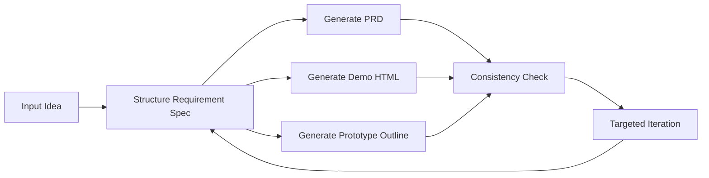

# PRD Pilot

> AI PRD and demo workspace for product managers.

PRD Pilot helps product managers turn vague product ideas into reviewable PRDs and demo-ready prototypes with AI.

Core flow:

`Idea -> Requirement Spec -> PRD / Demo / Prototype Outline -> Consistency Check -> Targeted Iteration`

## Why PRD Pilot

Many AI tools can generate "something" quickly, but the outputs often drift:

- the PRD says one thing
- the demo shows another thing
- the interaction flow breaks in review
- feedback forces a full rewrite instead of a scoped edit

PRD Pilot is built to solve that gap.

## Who It's For

- student product managers who need to prepare requirement reviews quickly
- indie developers who need to turn raw ideas into reviewable specs and demos
- small teams without dedicated design or frontend prototyping support

## What It Does

- structures raw input into a shared `Requirement Spec`
- generates a Chinese PRD draft from the same spec
- generates a single-file HTML demo and a prototype outline
- checks consistency across PRD, demo, and outline
- supports targeted iteration instead of blind full regeneration
- supports in-browser model configuration with OpenAI-compatible APIs

## Workflow



## Core Features

### 1. Requirement Spec Layer

PRD Pilot first normalizes user input into a shared internal structure:

- `product_name`
- `product_type`
- `target_users`
- `user_pain_points`
- `core_scenarios`
- `key_features`
- `primary_pages`
- `user_flow`
- `style_preference`
- `constraints`
- `success_criteria`

This spec becomes the single source of truth for generation, checking, and iteration.

### 2. Generation

- `PRD`: Chinese Markdown draft for requirement review
- `Demo`: single-file HTML prototype for direct preview/download
- `Prototype Outline`: page structure, flow, and validation goals

### 3. Validation

Built-in consistency checks include:

- page coverage
- feature coverage
- flow connectivity
- naming consistency
- prototype alignment
- scenario coverage

### 4. Targeted Iteration

Instead of redoing everything, PRD Pilot supports scoped updates such as:

- add page
- modify user
- remove feature
- adjust layout
- change style
- improve data density
- simplify PRD
- clarify flow

Each iteration returns a short change summary.

## Model Configuration

PRD Pilot supports page-level model configuration. Users can open the top-right model dialog and provide:

- provider
- model name
- API key
- base URL
- max tokens (optional; blank means auto)

Built-in provider presets:

- DeepSeek
- OpenAI
- OpenRouter
- Zhipu / GLM
- SiliconFlow
- Moonshot
- Groq
- DashScope / Qwen
- Ollama (Local)
- Custom OpenAI Compatible

The UI stores this configuration only in the current browser. It is not written back to the server.

## Tech Stack

### Frontend

- Vue 3
- Vite
- Element Plus
- Tailwind CSS
- MarkdownIt
- VueUse

### Backend

- FastAPI
- OpenAI-compatible API client
- Pydantic
- Python Dotenv

## Project Structure

```text
.
├─ prd-pilot/
│  ├─ backend/
│  │  ├─ main.py
│  │  ├─ requirements.txt
│  │  └─ services/
│  │     └─ llm_service.py
│  └─ frontend/
│     ├─ src/
│     │  └─ App.vue
│     ├─ package.json
│     └─ vite.config.js
├─ README.md
├─ 使用说明.md
├─ PRD Pilot项目文档.md
└─ LICENSE
```

## Quick Start

### 1. Backend

```bash
cd prd-pilot/backend
pip install -r requirements.txt
copy .env.example .env
python main.py
```

Default example config:

```env
OPENAI_PROVIDER=deepseek
OPENAI_API_KEY=your_deepseek_api_key_here
OPENAI_BASE_URL=https://api.deepseek.com/v1
OPENAI_MODEL=deepseek-chat
OPENAI_MAX_TOKENS=0
APP_HOST=0.0.0.0
APP_PORT=8000
```

`OPENAI_MAX_TOKENS=0` means the backend will not explicitly pass `max_tokens` and will let the selected model use its available output limit.

### 2. Frontend

```bash
cd prd-pilot/frontend
npm install
npm run dev
```

### 3. Open in browser

- Frontend: [http://localhost:5173](http://localhost:5173)
- Backend health: [http://localhost:8000/api/health](http://localhost:8000/api/health)

## API

- `GET /api/model-options`
- `POST /api/test-model-config`
- `POST /api/structure-requirement`
- `POST /api/generate-prd`
- `POST /api/generate-demo`
- `POST /api/check-consistency`
- `POST /api/iterate-prd`
- `POST /api/iterate-demo`
- `GET /api/health`
- `GET /api/test-llm`

## Current Scope

- prototype output is `HTML Demo + Prototype Outline`
- no image-based prototype generation yet
- no persistent version rollback yet
- consistency check v1 is rule-based, not AI-score-driven

## Recommended Next Assets For Open Source Release

These are still worth adding before a public GitHub release page is considered complete:

- screenshots or GIFs of the main workflow
- 1 to 2 sample cases
- a short demo video

## License

MIT


