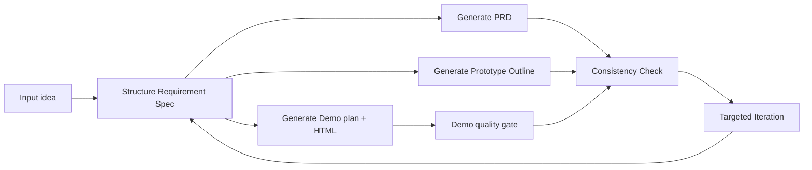

# PRD Pilot

> AI workspace for product managers to turn vague ideas into Requirement Specs, PRDs, demo-ready HTML prototypes, consistency reports, and targeted iteration plans.

[中文文档](docs/README.zh-CN.md)


## What It Solves

PRD Pilot is built for product managers, indie builders, and small teams that need to move from a vague idea to a reviewable solution quickly.

Most generators can output a PRD or a mockup, but the workflow usually breaks when:

- the PRD and demo drift apart
- key pages or flows go missing
- feedback turns into a full rewrite

PRD Pilot keeps one shared `Requirement Spec` through generation, validation, and iteration so the output stays aligned.

## Preview

| Requirement Spec | Demo Preview | Consistency Check |
| --- | --- | --- |
|  |  |  |

| PRD Draft | Targeted Iteration | Home Workspace |
| --- | --- | --- |
|  |  |  |

## Core Workflow



## Key Capabilities

### Shared Requirement Spec

PRD Pilot first structures user input into a single internal spec:

- `product_name`
- `product_type`
- `target_users`
- `user_pain_points`
- `core_scenarios`
- `key_features`
- `primary_pages`
- `user_flow`
- `style_preference`
- `constraints`
- `success_criteria`

This spec becomes the source of truth for generation, checks, and iteration.

### PRD + Demo + Prototype Outline

- `PRD`: Chinese Markdown draft for review
- `Demo`: single-file HTML prototype for preview and download
- `Prototype Outline`: structure, flow, and validation goals

### Demo Quality Gate

The demo pipeline now validates:

- HTML completeness
- key button presence
- interaction signals
- main page connectivity
- result and feedback state coverage

If quality fails, PRD Pilot attempts one repair pass before returning a structured error.

### Consistency Check v2

Built-in checks cover:

- page coverage
- feature coverage
- flow connectivity
- naming consistency
- prototype alignment
- scenario coverage

Reports include:

- severity
- evidence
- issue list
- repair actions that can be mapped into targeted iteration

### Targeted Iteration

Instead of regenerating everything, PRD Pilot supports scoped updates such as:

- add page
- modify user
- remove feature
- adjust layout
- change style
- improve data density
- simplify PRD
- clarify flow

Each iteration returns:

- `change_summary`
- `changed_sections`
- `affected_pages`

### External Integrations

PRD Pilot now officially includes:

- thin MCP service in [`mcp/`](mcp/README.md)
- Claude Code skill in [`.claude/skills/prd-pilot/SKILL.md`](.claude/skills/prd-pilot/SKILL.md)
- shared `use_cases` layer used by Web API, MCP, and tests

See [docs/integration.md](docs/integration.md) for setup details.

## Examples

Standard cases are included in [`prd-pilot/docs/examples/`](prd-pilot/docs/examples/README.md):

- [Campus Secondhand Marketplace](prd-pilot/docs/examples/campus-secondhand-marketplace.md)
- [AI Resume Optimizer](prd-pilot/docs/examples/ai-resume-optimizer.md)

## Quick Start

### 1. Start the backend

```bash
cd prd-pilot/backend
pip install -r requirements.txt
copy .env.example .env
python main.py
```

Example `.env`:

```env
OPENAI_PROVIDER=deepseek
OPENAI_API_KEY=your_deepseek_api_key_here
OPENAI_BASE_URL=https://api.deepseek.com/v1
OPENAI_MODEL=deepseek-chat
OPENAI_MAX_TOKENS=0
APP_HOST=127.0.0.1
APP_PORT=8000
```

### 2. Start the frontend

```bash
cd prd-pilot/frontend
npm install
npm run dev
```

The frontend reads `VITE_API_BASE_URL` if you want to override the default `/api` path. In local dev, Vite proxies `/api` to `http://127.0.0.1:8000`.

### 3. Open the app

- Frontend: [http://127.0.0.1:5173](http://127.0.0.1:5173)
- Backend health: [http://127.0.0.1:8000/api/health](http://127.0.0.1:8000/api/health)

## API

- `GET /api/model-options`
- `POST /api/test-model-config`
- `POST /api/structure-requirement`
- `POST /api/generate-prd`
- `POST /api/generate-demo`
- `POST /api/check-consistency`
- `POST /api/iterate-prd`
- `POST /api/iterate-demo`
- `GET /api/health`
- `GET /api/test-llm`

`generate-demo` and `iterate-demo` now return:

- `demo_quality`
- `generation_meta`

Structured demo-stage failures return:

- `error_code`
- `stage`
- `retryable`
- `detail`

## Tests and CI

The repository now includes:

- backend `pytest` coverage for `use_cases`, structured demo errors, and consistency output
- Playwright smoke coverage for the web happy path and demo timeout path
- GitHub Actions workflow for backend tests, frontend build, and browser smoke tests

## Tech Stack

### Frontend

- Vue 3
- Vite
- Element Plus
- Tailwind CSS
- MarkdownIt
- VueUse
- Playwright

### Backend

- FastAPI
- OpenAI-compatible API client
- Pydantic
- Python Dotenv
- FastMCP / MCP
- Pytest

## Project Structure

```text
.
+-- prd-pilot/
|   +-- backend/
|   |   +-- main.py
|   |   +-- requirements.txt
|   |   +-- services/
|   |   |   +-- llm_service.py
|   |   |   +-- use_cases.py
|   |   |   +-- mock_llm_service.py
|   |   +-- tests/
|   +-- frontend/
|   |   +-- src/
|   |   |   +-- App.vue
|   |   +-- tests/e2e/
|   |   +-- package.json
|   |   +-- vite.config.js
+-- mcp/
+-- docs/
|   +-- README.zh-CN.md
|   +-- integration.md
|   +-- screenshots/
+-- .claude/skills/prd-pilot/
+-- .github/workflows/
+-- README.md
+-- LICENSE
```

## Current Scope

- prototype output is `HTML Demo + Prototype Outline`
- consistency checks are rule-based, not AI-score-driven
- targeted iteration is scoped, but not yet a persistent version system
- no image-based prototype generation

## License

MIT
