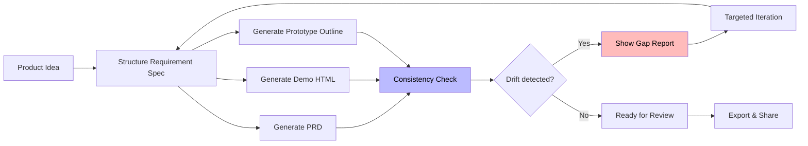

# PRD Pilot

> AI workspace for product managers — turn ideas into PRDs, HTML demos, and consistency-checked prototypes in minutes instead of days.

[](https://github.com/156181679-dev/prd-pilot/stargazers)
[](https://github.com/156181679-dev/prd-pilot/network/members)
[](https://opensource.org/licenses/MIT)
[](https://github.com)
[](https://github.com/156181679-dev/prd-pilot/commits/main)

[English](README.md) · [中文说明](docs/README.zh-CN.md)

---

## The Problem

Every AI generator can produce a PRD or a mockup in seconds. But in real review sessions, this happens:

```
PRD says "user can export data"
Demo says "export button is disabled"
→ 30 minutes of confusion → full rewrite
```

The root cause: **PRD and Demo are generated separately, with no shared source of truth.** They drift apart the moment you iterate.

---

## The Solution

PRD Pilot introduces a **shared Requirement Spec** that anchors every output:

```
Input → Requirement Spec → [PRD, Demo, Prototype Outline]
                                ↓
                    Consistency Check (built-in)
                                ↓
                    Targeted Iteration (scoped)
                                ↓
                         Requirement Spec (updated)
```

**PRD Pilot's superpower: built-in consistency checking.** Every time you generate or update a PRD or Demo, PRD Pilot cross-validates them against the shared spec and each other — catching drift before it reaches your review meeting.

---

## Screenshots

| Workspace | Requirement Spec | PRD Draft |
| --- | --- | --- |
|  |  |  |

| Demo Preview | Consistency Check | Targeted Iteration |
| --- | --- | --- |
|  |  |  |

---

## Key Features

### 🔄 One Spec, Three Outputs
Everything starts from a structured **Requirement Spec** — 10 fields that capture what you're building and for whom. From that one spec, PRD Pilot generates:
- 📄 **PRD Draft** — Chinese Markdown ready for stakeholder review
- 🎨 **HTML Demo** — Single-file, no-dependency prototype you can share instantly
- 🗺️ **Prototype Outline** — Page structure, flows, and validation goals

### ✅ Built-in Consistency Checking
PRD Pilot checks PRD and Demo against each other and against the Requirement Spec:

| Check | What it catches |
| --- | --- |
| Page coverage | Pages in PRD but missing in Demo |
| Feature coverage | Features in spec but missing in PRD/Demo |
| Flow connectivity | Flows that start but don't reach an end state |
| Naming consistency | Different terms for the same concept |
| Prototype alignment | HTML elements that don't match spec descriptions |
| Scenario coverage | Core user scenarios not covered by any page |

### 🎯 Scoped Iteration (No Full Rewrites)
Instead of regenerating everything on every feedback cycle, PRD Pilot supports targeted updates:

- Add / remove a page
- Adjust target users
- Change layout hierarchy
- Switch prototype style
- Simplify or expand PRD
- Clarify a specific flow

Each iteration returns a **change summary** so reviewers can track what changed and why.

### 🤖 Multi-Model Support
Use any OpenAI-compatible model. Built-in presets:

| Provider | Example Models |
| --- | --- |
| DeepSeek | deepseek-chat, deepseek-reasoner |
| OpenAI | GPT-4o, GPT-4.1, GPT-5 |
| OpenRouter | Claude 3.7 Sonnet, Gemini 2.5 Flash, GPT-4.1 |
| Zhipu / GLM | glm-4-plus, glm-4.5 |
| SiliconFlow | Qwen3-32B, DeepSeek-V3 |
| Moonshot | moonshot-v1-128k |
| Groq | llama-3.3-70b-versatile |
| DashScope / Qwen | qwen-turbo, qwen-max |
| Ollama (Local) | qwen2.5:7b, llama3.1:8b |

---

## Quick Start

### 1. Clone & start backend

```bash
git clone https://github.com/156181679-dev/prd-pilot.git
cd prd-pilot/backend
pip install -r requirements.txt
cp .env.example .env
# Edit .env with your API key (see provider presets below)
python main.py
```

### 2. Start frontend (new terminal)

```bash
cd prd-pilot/frontend
npm install
npm run dev
```

### 3. Open

- Frontend: [http://localhost:5173](http://localhost:5173)
- Backend API docs: [http://localhost:8000/docs](http://localhost:8000/docs)

---

## `.env` Configuration Examples

**DeepSeek (default)**
```env
OPENAI_PROVIDER=deepseek
OPENAI_API_KEY=your_deepseek_api_key
OPENAI_BASE_URL=https://api.deepseek.com/v1
OPENAI_MODEL=deepseek-chat
```

**OpenAI**
```env
OPENAI_PROVIDER=openai
OPENAI_API_KEY=your_openai_api_key
OPENAI_BASE_URL=https://api.openai.com/v1
OPENAI_MODEL=gpt-4o
```

**OpenRouter (Claude, Gemini, etc.)**
```env
OPENAI_PROVIDER=openrouter
OPENAI_API_KEY=your_openrouter_api_key
OPENAI_BASE_URL=https://openrouter.ai/api/v1
OPENAI_MODEL=anthropic/claude-3.7-sonnet
```

---

## Workflow



---

## Who It's For

| User | What PRD Pilot helps with |
| --- | --- |
| **Student PMs** | Prepare requirement reviews without a full redesign cycle |
| **Indie Hackers** | Go from idea to investor-ready spec + demo in one sitting |
| **Small Teams** | Ship reviewable PRDs and prototypes without a designer |
| **AI Toolchain Builders** | Use the API to integrate PRD/Demo generation into your own workflow |

---

## API Reference

Base URL: `http://localhost:8000`

| Endpoint | Method | Description |
| --- | --- | --- |
| `/api/health` | GET | Health check |
| `/api/model-options` | GET | List available models |
| `/api/test-model-config` | POST | Test API key + model connection |
| `/api/structure-requirement` | POST | Generate Requirement Spec from brief |
| `/api/generate-prd` | POST | Generate PRD from Requirement Spec |
| `/api/generate-demo` | POST | Generate HTML Demo from Requirement Spec |
| `/api/check-consistency` | POST | Cross-check PRD + Demo against Spec |
| `/api/iterate-prd` | POST | Scoped PRD update |
| `/api/iterate-demo` | POST | Scoped Demo update |

Full API docs at [http://localhost:8000/docs](http://localhost:8000/docs).

---

## Tech Stack

| Layer | Stack |
| --- | --- |
| Frontend | Vue 3 · Vite · Element Plus · Tailwind CSS |
| Backend | FastAPI · Python · OpenAI-compatible client · Pydantic |
| LLM | Any OpenAI-compatible API (DeepSeek, OpenAI, Claude, Gemini, Local, ...) |

---

## Project Structure

```
prd-pilot/
├── prd-pilot/
│   ├── backend/              # FastAPI backend
│   │   ├── main.py          # API endpoints
│   │   ├── services/
│   │   │   └── llm_service.py  # LLM orchestration + prompts
│   │   └── requirements.txt
│   └── frontend/             # Vue 3 + Vite frontend
│       ├── src/
│       │   └── App.vue       # Main application
│       └── package.json
├── docs/
│   ├── README.zh-CN.md      # Chinese documentation
│   └── screenshots/         # UI screenshots
├── README.md
├── CONTRIBUTING.md
├── ROADMAP.md
└── LICENSE
```

---

## Roadmap

See [ROADMAP.md](ROADMAP.md) for what's coming next.

---

## Contributing

See [CONTRIBUTING.md](CONTRIBUTING.md) for setup instructions, code conventions, and how to submit changes.

---

## License

MIT © An (@NSPChaos)
