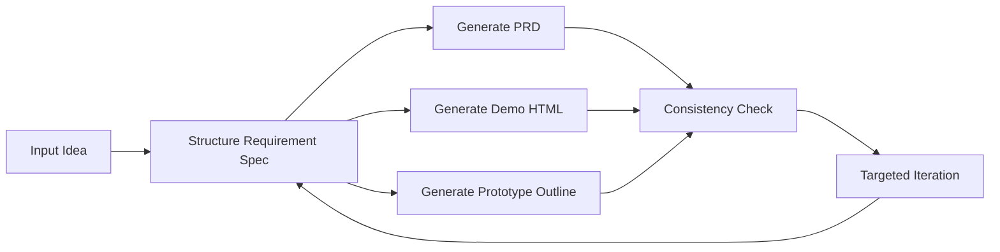

# PRD Pilot

> AI workspace for product managers to turn ideas into Requirement Specs, PRDs, demo-ready HTML prototypes, and targeted iteration plans.

[中文文档](docs/README.zh-CN.md)


## What It Solves

Most AI generators can output a PRD or a mockup quickly, but the result often breaks during review:

- the PRD and demo drift apart
- key pages or flows go missing
- feedback turns into a full rewrite

PRD Pilot keeps one shared `Requirement Spec` across generation, validation, and iteration so product ideas can move from vague input to reviewable output with less drift.

## Preview

| Requirement Spec | Demo Preview | Consistency Check |
| --- | --- | --- |
|  |  |  |

| PRD Draft | Targeted Iteration | Home Workspace |
| --- | --- | --- |
|  |  |  |

## Quick Start

### 1. Start the backend

```bash
cd prd-pilot/backend
pip install -r requirements.txt
copy .env.example .env
python main.py
```

Example `.env`:

```env
OPENAI_PROVIDER=deepseek
OPENAI_API_KEY=your_deepseek_api_key_here
OPENAI_BASE_URL=https://api.deepseek.com/v1
OPENAI_MODEL=deepseek-chat
OPENAI_MAX_TOKENS=0
APP_HOST=0.0.0.0
APP_PORT=8000
```

### 2. Start the frontend

```bash
cd prd-pilot/frontend
npm install
npm run dev
```

### 3. Open the app

- Frontend: [http://localhost:5173](http://localhost:5173)
- Backend health: [http://localhost:8000/api/health](http://localhost:8000/api/health)

## Core Features

### Shared Requirement Spec

PRD Pilot first structures user input into a single internal spec:

- `product_name`
- `product_type`
- `target_users`
- `user_pain_points`
- `core_scenarios`
- `key_features`
- `primary_pages`
- `user_flow`
- `style_preference`
- `constraints`
- `success_criteria`

This spec becomes the shared source of truth for every later step.

### PRD, Demo, and Prototype Outline

- `PRD`: Chinese Markdown draft for requirement review
- `Demo`: single-file HTML prototype for direct preview and download
- `Prototype Outline`: page structure, flow, and validation goals

### Consistency Check

Built-in checks cover:

- page coverage
- feature coverage
- flow connectivity
- naming consistency
- prototype alignment
- scenario coverage

### Targeted Iteration

Instead of regenerating everything, PRD Pilot supports scoped updates such as:

- add page
- modify user
- remove feature
- adjust layout
- change style
- improve data density
- simplify PRD
- clarify flow

Each iteration returns a short change summary.

### In-Browser Model Configuration

The UI supports page-level model configuration for OpenAI-compatible APIs:

- provider
- model name
- API key
- base URL
- max tokens (optional; blank means auto)

Built-in presets:

- DeepSeek
- OpenAI
- OpenRouter
- Zhipu / GLM
- SiliconFlow
- Moonshot
- Groq
- DashScope / Qwen
- Ollama (Local)
- Custom OpenAI Compatible

## Workflow



## Who It's For

- student product managers who need to prepare requirement reviews quickly
- indie developers who need reviewable specs and demo-ready prototypes
- small teams without dedicated design or frontend prototyping support

## API

- `GET /api/model-options`
- `POST /api/test-model-config`
- `POST /api/structure-requirement`
- `POST /api/generate-prd`
- `POST /api/generate-demo`
- `POST /api/check-consistency`
- `POST /api/iterate-prd`
- `POST /api/iterate-demo`
- `GET /api/health`
- `GET /api/test-llm`

## Integration Surface

- MCP / client setup: [docs/integration.md](docs/integration.md)
- Local MCP server entry: [mcp/mcp_service.py](mcp/mcp_service.py)
- Claude Code Skill: [.claude/skills/prd-pilot/SKILL.md](.claude/skills/prd-pilot/SKILL.md)

## Tech Stack

### Frontend

- Vue 3
- Vite
- Element Plus
- Tailwind CSS
- MarkdownIt
- VueUse

### Backend

- FastAPI
- OpenAI-compatible API client
- Pydantic
- Python Dotenv

## Project Structure

```text
.
├─ prd-pilot/
│  ├─ backend/
│  │  ├─ main.py
│  │  ├─ requirements.txt
│  │  └─ services/
│  │     └─ llm_service.py
│  └─ frontend/
│     ├─ src/
│     │  └─ App.vue
│     ├─ package.json
│     └─ vite.config.js
├─ docs/
│  ├─ README.zh-CN.md
│  └─ screenshots/
├─ README.md
└─ LICENSE
```

## Current Scope

- prototype output is `HTML Demo + Prototype Outline`
- no image-based prototype generation yet
- no persistent version rollback yet
- consistency check v1 is rule-based, not AI-score-driven

## License

MIT
